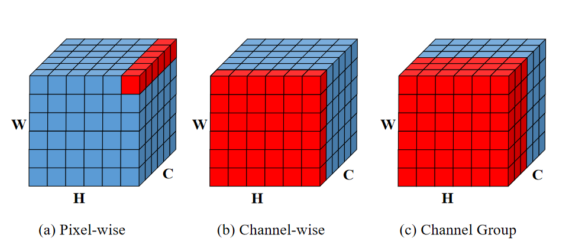
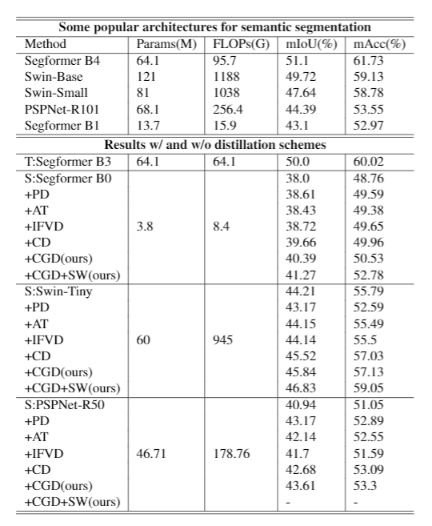
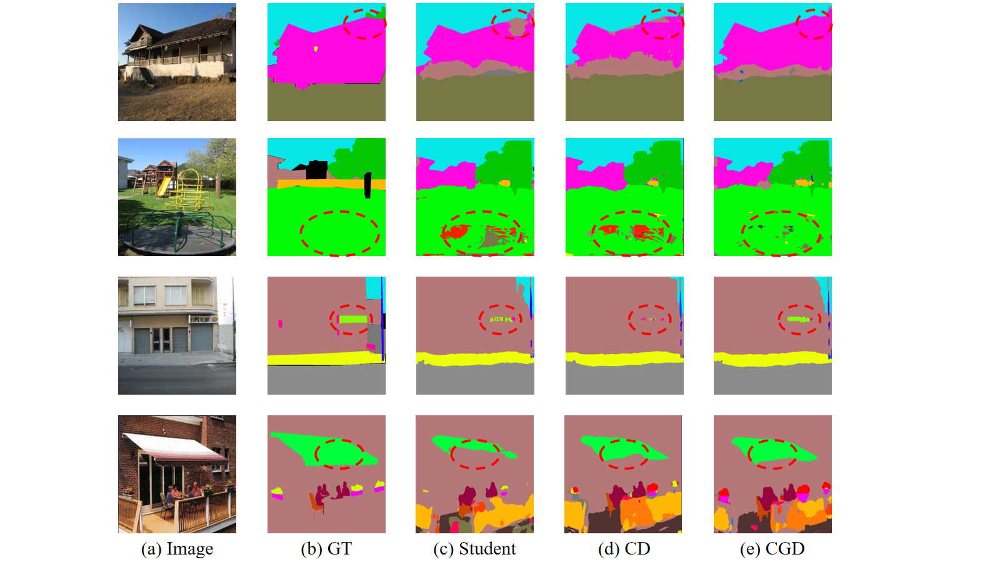

# SegDistill: Toolbox for Knowledge Distillation on Semantic Segmentation Networks

This repo contains the supported code and configuration files for SegDistill .It is based on [mmsegmentaion](https://github.com/open-mmlab/mmsegmentation/tree/v0.11.0).

## Installation

```bash
conda create -n mmcv python=3.8 -y
conda activate mmcv

pip install torch==1.7.1+cu110 torchvision==0.8.2+cu110 torchaudio==0.7.2 -f https://download.pytorch.org/whl/torch_stable.html

pip install mmcv-full==1.2.2 -f https://download.openmmlab.com/mmcv/dist/cu110/torch1.7.0/index.html

pip install future tensorboard
pip install IPython
pip install attr
pip install timm

git clone https://github.com/wzpscott/SegDistill.git -b main
cd SegDistill
pip install -e .
```

## Prepare Data

We conducted experiments on ADE20k dataset. The training and validation set of ADE20K could be download from this [link](http://data.csail.mit.edu/places/ADEchallenge/ADEChallengeData2016.zip). Test set can be download from [here](http://data.csail.mit.edu/places/ADEchallenge/release_test.zip). After downloading the dataset, you need to arrange the structure of your dataset like:

```
mmsegmentation
├── mmseg
├── tools
├── configs
├── data
│   ├── ade
│   │   ├── ADEChallengeData2016
│   │   │   ├── annotations
│   │   │   │   ├── training
│   │   │   │   ├── validation
│   │   │   ├── images
│   │   │   │   ├── training
│   │   │   │   ├── validation
│   ├── ...
```

See [here](https://mmsegmentation.readthedocs.io/en/latest/dataset_prepare.html) for more instructions on data preparation.

## Prepare Models

We provide links to pretrained weights of models used in the paper.

| Model            | Pretrained on ImageNet-1K                                    | Trained on ADE20k                                            |
| ---------------- | ------------------------------------------------------------ | ------------------------------------------------------------ |
| Segformer        | [link](https://drive.google.com/drive/folders/1b7bwrInTW4VLEm27YawHOAMSMikga2Ia) | [link](https://drive.google.com/drive/folders/1GAku0G0iR9DsBxCbfENWMJ27c5lYUeQA) |
| Swin-Transformer | [link](https://github.com/SwinTransformer/storage/releases/download/v1.0.1/upernet_swin_base_patch4_window7_512x512.pth) | [link](https://github.com/SwinTransformer/storage/releases/download/v1.0.1/upernet_swin_base_patch4_window7_512x512.pth) |
| PSPNet           | [link](https://download.openmmlab.com/mmsegmentation/v0.5/pspnet/pspnet_r101-d8_512x512_80k_ade20k) | [link](https://download.openmmlab.com/mmsegmentation/v0.5/pspnet/pspnet_r101-d8_512x512_80k_ade20k/pspnet_r101-d8_512x512_80k_ade20k_20200614_031423-b6e782f0.pth) |
## Write configs for semantic segmentaion KD

We use mmcv-fashion configs to control the KD process.

Run an example config with the following command:

```
 bash tools/dist_train.sh distillation_configs/example_config.py {num_gpu}
```

See [here]() for detailed instructions for custom KD process on various network architectures.

## Channel Group Distillation

Our Channel Group Distillation (CGD) considers a more extensive range of correlations inthe activation map and works well fortransformer structures than previous KD methods.

Comparison to Other KD methods



Results on ADE20k
<div  align="center">    

</div>

Qualitative segmentation results on ADE20k produced from Segformer B0: (a) raw images, (b) ground truth (GT), (c) outputof the original student model (d) Channel-wise Distillation (CD) and (e) Channel Group Distillation(CGD)

